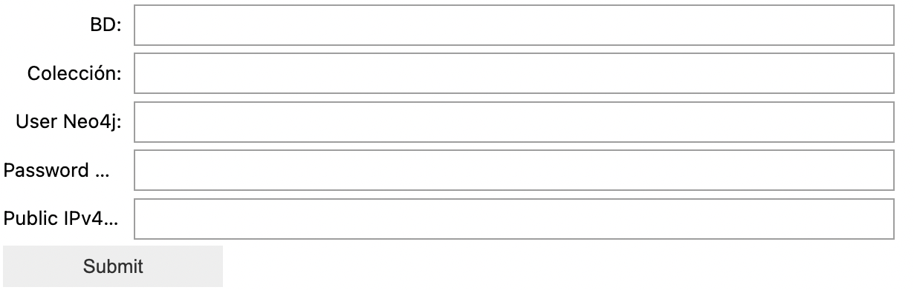
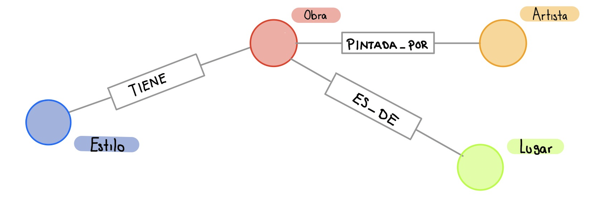

# Trabajo final de BD_NR

Integrantes del equipo:
  - Isaac Pimentel
  - Alejandra Arredondo
  - Javier Nieto

## Índice

- [El proyecto](#El-proyecto)
- [Instructivo](#Instructivo)
- [Resultados](#Resultados)
  -  [Base en MongoDB](#Base-en-MongoDB) 
  -  [Base en Neo4j](#Base-en-Neo4j) 
- [Video](#Video)
- [Programa](#Programa)
  - [API-MongoDB](#API-MongoDB)
  - [MongoDB-Neo4j](#MongoDB-Neo4j)
- [Queries](#Queries)
  - [MongoDB](#MongoDB)
  - [Neo4j](#Neo4j)

## El proyecto

Trata de una conexión a la API del museo Art Institute of Chicago para bajar hasta 1000 obras de arte a MongoDB y luego, mediante una conexión a AWS, prender una instancia y pasar los datos a Neo4j para visualizar las relaciones entre obras de arte.

## Instructivo

> **¡Antes de empezar!** Es importante que tengas prendida tu instancia de AWS y Docker prendido. Decidimos dejar de fuera un inicio de sesión directo con AWS en Python para no comprometer credenciales en el código.

Para correr el programa, se deben seguir los siguientes sencillos pasos:

1. Correr la primera celda de código
2. Llenar los inputs con los valores deseados/solicitados:
  - nombre de la BD para mongo
  - nombre de la colección para mongo
  - usuario de Neo4j
  - contraseña de Neo4j
3. Ejecutar todas las demás celdas.

## Resultados

### Base en MongoDB

Así se ve un JSON de la base de datos de MongoDB:

<pre> <code id="codeSnippet">{
    _id: ObjectId("6469151c33dc31742c4c4f43"),
    id: 8360,
    api_model: 'artworks',
    api_link: 'https://api.artic.edu/api/v1/artworks/8360',
    is_boosted: false,
    title: 'Te burao (The Hibiscus Tree)',
    alt_titles: null,
    thumbnail: {
      lqip: 'data:image/gif;base64,R0lGODlhBwAFAPUAACgyJSswJy8xJCs0JyozLTc2MDs7NTo9PDNBNTdAPE1KOU1JRk9ORlFOR1tSTllXTFhWTlFTUllcVWNdUmJfU1VhUGZjXGxkW3lpUXBkWn9tWmJhYWhnY39xYXh3d3d7eZGDa4iJh42QiAAAAAAAAAAAAAAAAAAAAAAAAAAAAAAAAAAAAAAAAAAAAAAAAAAAAAAAAAAAAAAAAAAAAAAAAAAAAAAAAAAAAAAAAAAAAAAAAAAAAAAAAAAAAAAAAAAAACH5BAAAAAAALAAAAAAHAAUAAAYhwJCEEABURBzPYSBIICIfCMNQUDwuG8eiQZlgLJmOBhQEADs=',
      width: 6883,
      height: 5080,
      alt_text: 'A work made of oil on cotton canvas.'
    },
    main_reference_number: '1923.308',
    has_not_been_viewed_much: false,
    boost_rank: null,
    date_start: 1892,
    date_end: 1892,
    date_display: '1892',
    date_qualifier_title: '',
    date_qualifier_id: null,
    artist_display: 'Paul Gauguin\nFrench, 1848-1903',
    place_of_origin: 'France',
    dimensions: '68 × 90.7 cm (26 3/4 × 35 11/16 in.)',
    dimensions_detail: [
      {
        depth_cm: 0,
        depth_in: 0,
        width_cm: 90.7,
        width_in: 35.6875,
        height_cm: 68,
        height_in: 26.75,
        diameter_cm: 0,
        diameter_in: 0,
        clarification: null
      }
    ],
    medium_display: 'Oil on cotton canvas',
    inscriptions: null,
    credit_line: 'Joseph Winterbotham Collection',
    catalogue_display: null,
    publication_history: '“An Exhibition of Modern French Paintings,” Bulletin of the Minneapolis Institute of Arts 10, 8 (November 1921), p. 59 (ill.). \n' +
      '\n' +
      '“El Greco Painting, $9,000: ‘St. John the Baptist’ leads Auction of the de Zayas Collection,” New York Times (March 24, 1923), p. 13. \n' + ... +
      'Art Institute of Chicago, Van Gogh and Gauguin: The Studio of the South, September 22, 2001–January 13, 2002, cat. 140; travelled to Amsterdam, The Van Gogh Museum, February 2–June 9, 2002.',
    provenance_text: 'Marius de Zayas, New York; sold his sale, The Anderson Galleries, New York, March 23–24, 1923, lot 83 for $3,000 to the Art Institute [price according to an annotated copy of the sale catalogue in the Ryerson Library, Art Institute]; purchased by the Art Institute with funds provided by Joseph Winterbotham for the Joseph Winterbotham Collection, 1923.',
    edition: null,
    publishing_verification_level: 'Web Cataloged',
    internal_department_id: 14,
    fiscal_year: 1923,
    fiscal_year_deaccession: null,
    is_public_domain: true,
    is_zoomable: true,
    max_zoom_window_size: -1,
    copyright_notice: null,
    has_multimedia_resources: true,
    has_educational_resources: false,
    has_advanced_imaging: false,
    colorfulness: 22.3291,
    color: {
      h: 209,
      l: 50,
      s: 15,
      percentage: 0.02212279677922593,
      population: 116
    },
    latitude: null,
    longitude: null,
    latlon: null,
    is_on_view: false,
    on_loan_display: '
On loan to Museu de Arte de São Paulo Assis Chateaubriand in São Paulo for <i>Gauguin: The Other and I</i>
',
    gallery_title: null,
    gallery_id: null,
    artwork_type_title: 'Painting',
    artwork_type_id: 1,
    department_title: 'Painting and Sculpture of Europe',
    department_id: 'PC-10',
    artist_id: 34611,
    artist_title: 'Paul Gauguin',
    alt_artist_ids: [],
    artist_ids: [ 34611 ],
    artist_titles: [ 'Paul Gauguin' ],
    category_ids: [ 'PC-10' ],
    category_titles: [ 'Painting and Sculpture of Europe' ],
    term_titles: [
      'oil on canvas',
      'Post-Impressionism',
      'oil paint (paint)',
      'Century of Progress',
      'painting',
      'european painting',
      'weather/seasons',
      'landscapes',
      'water',
      "world's fairs",
      "Chicago World's Fairs"
    ],
    style_id: 'TM-7547',
    style_title: 'Post-Impressionism',
    alt_style_ids: [],
    style_ids: [ 'TM-7547' ],
    style_titles: [ 'Post-Impressionism' ],
    classification_id: 'TM-66',
    classification_title: 'oil on canvas',
    alt_classification_ids: [ 'TM-9', 'TM-54' ],
    classification_ids: [ 'TM-66', 'TM-9', 'TM-54' ],
    classification_titles: [ 'oil on canvas', 'painting', 'european painting' ],
    subject_id: 'TM-12169',
    alt_subject_ids: [ 'TM-10095', 'TM-8657', 'TM-8681', 'TM-11299', 'TM-12176' ],
    subject_ids: [
      'TM-12169',
      'TM-10095',
      'TM-8657',
      'TM-8681',
      'TM-11299',
      'TM-12176'
    ],
    subject_titles: [
      'Century of Progress',
      'weather/seasons',
      'landscapes',
      'water',
      "world's fairs",
      "Chicago World's Fairs"
    ],
    material_id: 'TM-2451',
    alt_material_ids: [],
    material_ids: [ 'TM-2451' ],
    material_titles: [ 'oil paint (paint)' ],
    technique_id: null,
    alt_technique_ids: [],
    technique_ids: [],
    technique_titles: [],
    theme_titles: [],
    image_id: '604fe021-6008-f666-bce8-456b2fdc9bd4',
    alt_image_ids: [],
    document_ids: [],
    sound_ids: [],
    video_ids: [],
    text_ids: [],
    section_ids: [ Long("39582287106") ],
    section_titles: [ 'Cat. 28  Te burao (The Hibiscus Tree), 1892' ],
    site_ids: [],
    suggest_autocomplete_all: [
      {
        input: [ '1923.308' ],
        contexts: { groupings: [ 'accession' ] }
      },
      {
        input: [ 'Te burao (The Hibiscus Tree)' ],
        weight: 5589,
        contexts: { groupings: [ 'title' ] }
      }
    ],
    source_updated_at: '2023-05-20T00:30:05-05:00',
    updated_at: '2023-05-20T00:33:14-05:00',
    timestamp: '2023-05-20T13:44:35-05:00'
  }</code></pre>

### Base en Neo4j

El resultado de la base de Neo4j nos regresa un conjunto de 4 tipos de nodos, relacionados entre sí como en el esquema a continuación.

INSERTAR IMAGEN.

Al buscar todos los nodos y todas sus relaciones, nuestra base de grafos se ve así (justo por eso elegimos esta base, se ve muy bien).

INSERTAR GIF/VIDEO

## Video

En caso de que no quieras descargar todo el repositorio y correrlo por tu cuenta, o simplemente no tengas instancias de AWS ni Docker pero quieras ver el resultado, te dejamos un video de cómo corre el programa :D.

ANEXAR VIDEO

## Programa

A continuación, explicamos un poco cómo está hecho nuestro proyecto final. Todo se encuentra en la carpeta de <code></code>.

### Inputs

Se piden inputs al principio para poder ejecutar el resto del código sin tener que llenar manualmente los datos. En el mismo notebook de Jupyter se genera una pequeña interfaz que pide información. Que se ve como la siguiente.

### API-MongoDB

La primera parte, consta de una conexión de la API del Art Institute of Chicago a MongoDB para crear una base de datos con JSONS. La limitante aquí fue que solo deja descargar hasta 100 obras. Lo bueno, es que esto hizo a nuestra base de datos de grafos muy bonita visualmente.

Para lograr la conexión, se usaron las librerías <code>pymongo</code> y <code>requests.</code>.

Finalmente, se descargan los datos de la API y se guardan en un arreglo de JSONS, insertándolo en la colección y base de datos con sus respectivos nombres introducidos en la interfaz de inputs.

### MongoDB-Neo4j

Para esta parte, se usó la librería de <code>neo4j</code>, importando de ahí <code>GraphDatabase</code> para poder establecer la conexión a Neo4j. De nuevo, se usan los valores dados en los inputs inicialmente para no tener que rellenar manualmente el usuario y contraseña de Neo4j.

Luego de esto, se recuperaron mediante los siguientes queries de MongoDB la información necesaria para crear cuatro entidades: Obra, Estilo, Lugar, Artista.

#### Obra
<pre> <code id="codeSnippet"> my_collection.aggregate([{ "$project": {
      "nombre": "$title",
      "id": "$id",
      "lugar_origen": "$place_of_origin",
      "artista": "$artist_title",
      "estilo": "$style_title",
      "tipo": "$medium_display",
      "_id": 0
    }
  }
]) </code></pre>

#### Estilo
<pre> <code id="codeSnippet"> my_collection.aggregate([
  {"$group": {"_id": "$style_title"}},
  {"$project":{"_id":0, "estilo":"$_id"}},
  {"$sort":{"estilo":1}}
]
) </code></pre>

#### Artista
<pre> <code id="codeSnippet"> my_collection.aggregate([
    {"$group": {"_id": "$artist_title"}},
    {"$project": {"_id": 0, "artista": "$_id"}},
    {"$sort": {"artista": 1}}
]) </code></pre>

#### Lugar
<pre> <code id="codeSnippet"> my_collection.aggregate([
  {"$group": {"_id": "$place_of_origin"}},
  {"$project":{"_id":0, "lugar":"$_id"}},
  {"$sort":{"lugar":1}}
]) </code></pre>

Luego, usando esta información, se crearon los respectivos nodos de la siguiente forma.

<pre> <code id="codeSnippet"> my_collection.aggregate([
  {"$group": {"_id": "$place_of_origin"}},
  {"$project":{"_id":0, "lugar":"$_id"}},
  {"$sort":{"lugar":1}}
]) </code></pre>

Teniendo ya los nodos, se crearon conexiones entre los nodos de la siguiente forma.

<pre> <code id="codeSnippet"> my_collection.aggregate([
  {"$group": {"_id": "$place_of_origin"}},
  {"$project":{"_id":0, "lugar":"$_id"}},
  {"$sort":{"lugar":1}}
]) </code></pre>

En un esquema, se vería de la siguiente forma:

Por último, se eliminaron los atributos no necesarios para la base, o que harían redundante la estructura.

<pre> <code id="codeSnippet"> my_collection.aggregate([
  {"$group": {"_id": "$place_of_origin"}},
  {"$project":{"_id":0, "lugar":"$_id"}},
  {"$sort":{"lugar":1}}
]) </code></pre>

## Queries

Compartimos por aquí los tres queries que diseñamos para la base de datos (tanto en MongoDB como en Neo4j).

### MongoDB

El primer query nos regresa los artistas que tienen más estilos.

<pre> <code id="codeSnippet"> # Query 1 
pipeline1 = [
    {
        '$group': {
            '_id': {
                'artist': '$artist_title'
            },
            'conteo_estilos': {
                '$addToSet': '$style_title'
            }
        }
    },
    {
        '$project': {
            '_id': 0,
            'artista': '$_id.artist',
            'conteo_estilos': { '$size': '$conteo_estilos' }
        }
    },
    {
        '$sort': {
            'conteo_estilos': -1,
        }
    },{
        '$limit': 5
    }
]

# Query

result1 = my_collection.aggregate(pipeline1)
</code></pre>

El segundo query trata de ____.

<pre> <code id="codeSnippet"> # Query 2 </code></pre>

El tercer query trata de ____.

<pre> <code id="codeSnippet"> # Query 3 </code></pre>

### Neo4j

El primer query, pero en Neo4j.

<pre> <code id="codeSnippet"> # Query 1 </code></pre>

El segundo query en Neo4j.

<pre> <code id="codeSnippet"> # Query 2 </code></pre>

El tercer query pero en Neo4j.

<pre> <code id="codeSnippet"> # Query 3 </code></pre>
